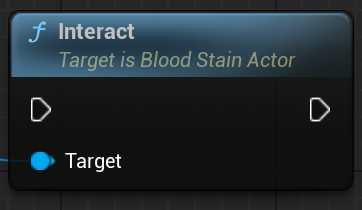

<!-- 
### Start Recording
	

Recording is done in Groups

## Properties
public FString ReplayFileName
public FString LevelName
public FBloodStainPlaybackOptions PlaybackOptions

uint8 bAllowMultiplePlayback : 1
FGuid LastPlaybackKey -->