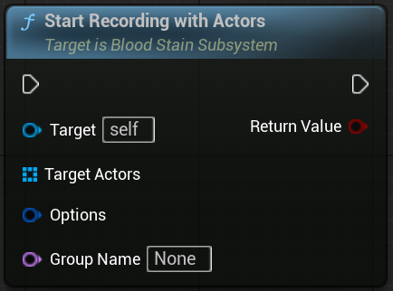

## Start Recording
	

#### Description

>If the group is already recording, join the group  
Record Component is Attached to the Target Actor

#### Inputs

| Type | Name | Description |
|------|------|-------------|
| UBloodStainSubsystem* | Target | The subsystem that controls recording |
| AActor* | Target Actor | The actor to record |
| FRecordOptions (Optional) | Options | Optional recording options |
| FName (Optional) | Group Name | Optional group name for organizing recordings |

#### Outputs

| Type | Name | Description |
|------|------|-------------|
| bool | Return Value | whether the recording start is successful |

 

## Start Recording With Actors
	

#### Description

>If the group is already recording, join the group  
Record Component is Attached to the Target Actor

#### Inputs

| Type | Name | Description |
|------|------|-------------|
| UBloodStainSubsystem* | Target | The subsystem that controls recording |
| TArray<AActor*> | Target Actors | The actors to record |
| FRecordOptions (Optional) | Options | Optional recording options |
| FName (Optional) | Group Name | Optional group name for organizing recordings |

#### Outputs

| Type | Name | Description |
|------|------|-------------|
| bool | Return Value | whether the recording start is successful |

 

## Stop Recording

#### Description

>Stop Recording Group

#### Inputs

| Type | Name | Description |
|------|------|-------------|
| UBloodStainSubsystem* | Target | The subsystem that controls recording |
| FName (Optional) | Group Name | Optional group name for organizing recordings |
| bool | Save Recording Data | if false, do not save |

 

## Stop Recording RecordComponent

#### Description

>Stop recording actor. 
Group don't stop recording. if you want to stop recording group, use `UBloodStainSubsystem::StopRecord`

#### Inputs

| Type | Name | Description |
|------|------|-------------|
| UBloodStainSubsystem* | Target | The subsystem that controls recording |
| URecordComponent | Record Component | Target Record Component |
| bool | Save Recording Data | if false, do not save |

 

## Start Replay From File

#### Inputs

| Type | Name | Description |
|------|------|-------------|
| UBloodStainSubsystem* | Target | The subsystem that controls recording |
| FString | File Name | File Name |
| FString | Level Name | Level Name |
| FBloodStainPlaybackOptions (Optional) | In Playback Options | Optional playback options |

#### Outputs

| Type | Name | Description |
|------|------|-------------|
| FGuid | Out Guid | Replaying Group Key |
| bool | return value | whether the start replay is successful |

 

## Start Replay by BloodStain

#### Inputs

| Type | Name | Description |
|------|------|-------------|
| UBloodStainSubsystem* | Target | The subsystem that controls recording |
| ABloodStainActor* | Blood Stain Actor | BloodStain Actor |

#### Outputs

| Type | Name | Description |
|------|------|-------------|
| FGuid | Out Guid | Replaying Group Key |
| bool | return value | whether the start replay is successful |

 

## Stop Replay

#### Inputs

| Type | Name | Description |
|------|------|-------------|
| UBloodStainSubsystem* | Target | The subsystem that controls recording |
| FGuid | Playback Key | Target Playback Key |

 

## Stop Replay playComponent

#### Description

>This don't stop All Actors Playback. if you want to stop All of them, use `UBloodStainSubsystem::StopReplay`

#### Inputs

| Type | Name | Description |
|------|------|-------------|
| UBloodStainSubsystem* | Target | The subsystem that controls recording |
| AGhostActor* | Ghost Actor | Target Playback GhostActor |

 

<!--        

# 테스트

#### Parameters
- **Target** (`UBloodStainSubsystem*`): The subsystem that manages the recording
- **Target Actor** (`AActor*`): The actor to be recorded
- **Options** (`FRecordOptions`, *optional*): Additional record settings
- **Group Name** (`FName`, *optional*): Name of the recording group

| Name | Type | Description |
|------|------|-------------|
| Target | UBloodStainSubsystem* | The subsystem that controls recording |
| Target Actor | AActor* | The actor to record |
| Options | FRecordOptions (Optional) | Optional recording options |
| Group Name | FName (Optional) | Optional group name for organizing recordings |

#### Returns
- **Return Value** (`bool`): `true` if recording started successfully, otherwise `false`.
- **Out Guid** (`FGuid`): The key identifying the replay group that started.

### Start Recording

Starts recording a specific actor in the scene.  
If the specified group is already recording, the actor is added to that group.  
Attaches a `RecordComponent` to the target actor to begin tracking.

Use `StopRecording` to finish and optionally save the recorded data. -->