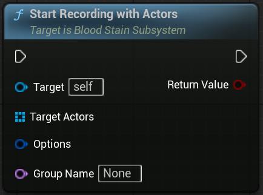
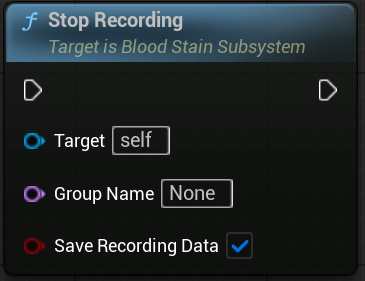
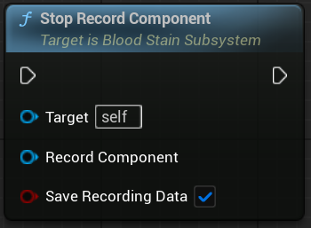
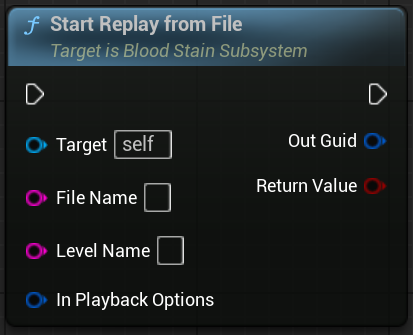
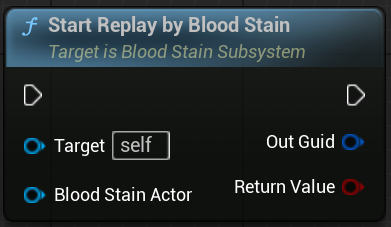
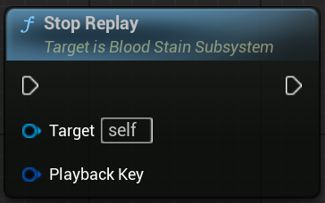
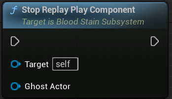

Share images with your friends! Send photos and pictures from your computer, phone or camera.

> Images are stored until you choose to remove them.

To share an image:

1. Open a message with someone
2. Select the **Send Media** button
3. Pick an image

# Interaction

### Start Recording
	

- <b>Target</b> : BloodStainSubSystem
- <b>Target Actor</b> : Record Target Actor
- <b>Options (Optional)</b> : Record Option
- <b>Group Name (Optional)</b> : Record Group Name

Recording is done in Groups

### Start Recording With Actors
	

### Stop Recording

### Stop Recording RecordComponent

### Start Replay From File

### Start Replay by BloodStain

### Stop Replay

### Stop Replay playComponent

# 

Supported types:

* JPEG
* PNG
* BMP
* GIF

Unsupported types:

* SVG
* WEBP
