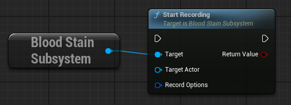
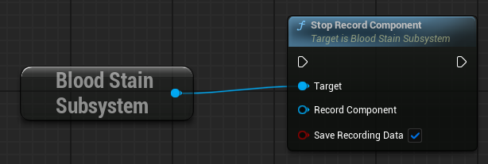
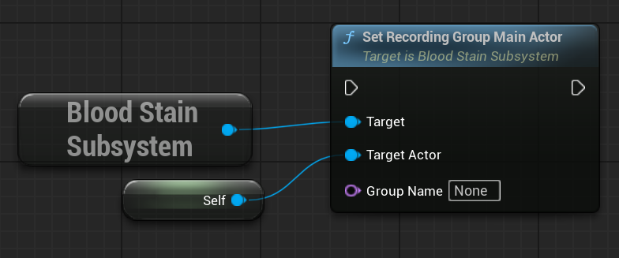

## OverView

This guide introduces how to record multiple Actors within a single Group (i.e., a single file).

This tutorial assumes you have completed the Quick Start.

### About Group

A Group is a collection of Actors associated with a single recording session. All recording start/stop operations and playback are performed on a per-Group basis. Each Group corresponds one-to-one with a File.

### Multiple Actor Record

When calling `UBloodStainSubSystem::StartRecording()`, if the specified Group is already recording, the Actor can join the ongoing recording.

Alternatively, you can call `UBloodStainSubSystem::StartRecordingWithActors()`.

Actors that join an existing Group recording later will use the original RecordOption set for that Group and `cannot override` it.

### If you want to stop recording a specific Actor

You can stop recording an Actor by calling `UBloodStainSubSystem::StopRecordComponent()` or when the `URecordComponent` is destroyed. Note that this does not stop the Group recording. Internally, the Actor's information is maintained for the duration of `MaxRecordTime`.

If `FBloodStainRecordOptions::bSaveImmediatelyIfGroupEmpty` is set to `true`, the Group recording will automatically end when there are no Actors left in the Group.

### BloodStain Spawn Transform

You can designate a representative Actor for the Record Group by calling `UBloodStainSubSystem::SetRecordingGroupMainActor()`.

If not specified, the Actor that first started the recording is automatically designated as the representative.
This is saved in `FRecordHeaderData::SpawnPointTransform`.

