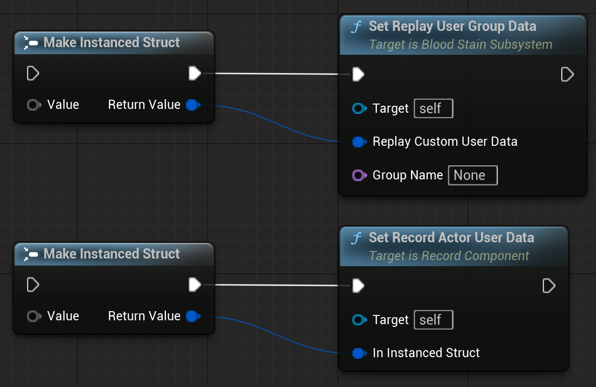

## OverView

This tutorial assumes you have completed the Quick Start.
This page explains how to save and use UserData within a file's Header Data.

For details on the file format, please refer to the `About File` page.

 

The struct used as input for User Data must use the `USTRUCT()` macro to be properly serialized and deserialized.

### Set User Data (C++)

You can pass the struct as a parameter using either `URecordComponent::SetRecordActorUserData<T>` or `UBloodStainSubSystem::SetReplayUserGroupData<T>`.

Note that if T is not marked with `USTRUCT`, a compile-time error will occur.

### Set User Data (Blueprint)

1. Connect the `Make Instanced Struct` node to the Set User Data node.

2. Connect the desired struct to the `Value` input of the `Make Instanced Struct` node.

