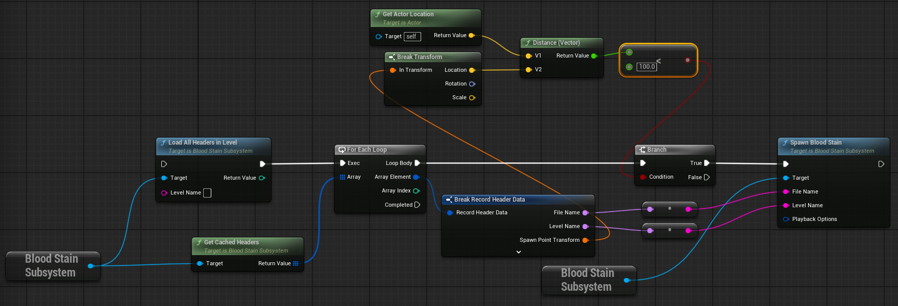

## OverView

This page explains which files are filtered and how they are filtered.
Loading and caching the files before filtering is covered on the `File Load & Cache` page.

This tutorial assumes you have completed the Quick Start.

### File Header
The header of a file contains various pieces of information. Based on this, we can select and use the desired file.

For details related to UserData, please refer to the `Customize Header Data` page.

### Key Variables

- `Tags : FGameplayTagContainer`
- `SpawnPointTransform : FTransform`
- `RecordGroupUserData : FInsatncedStruct`
- `RecordActorUserData : TArray<FInsatncedStruct>`

### Filtering on blueprint by SpawnPointTransform

1. Load the headers.

2. Iterate through each header and calculate the distance between the `SpawnPointTransform`'s location and the character's location.

3. Based on this, filter and spawn the desired file.

