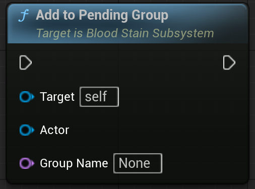
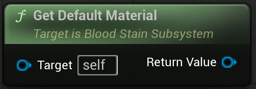
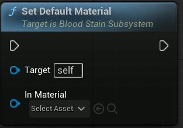
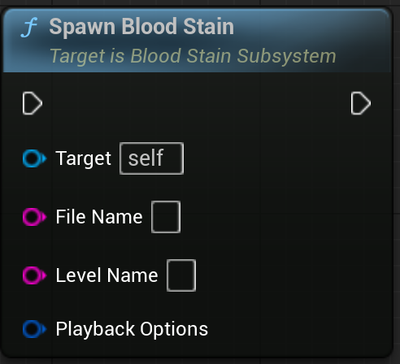
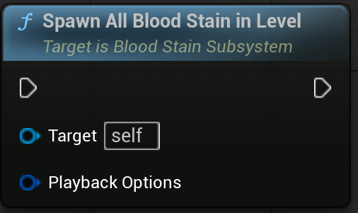
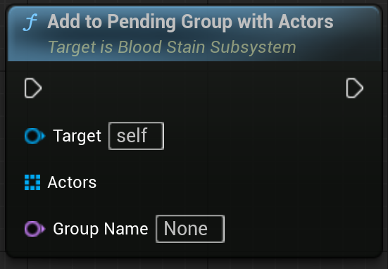
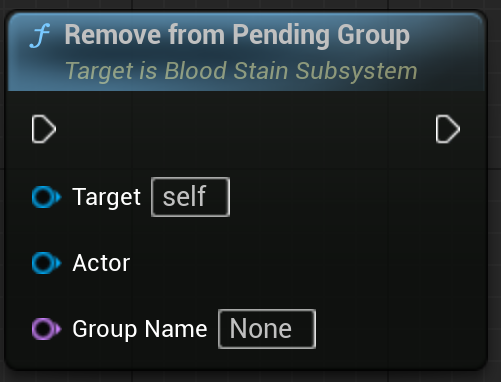
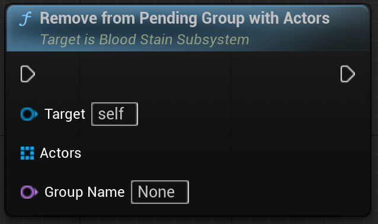
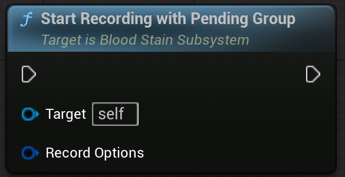
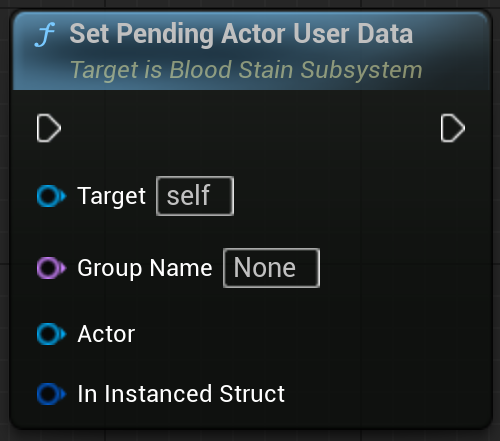

<!-- [StartRecording](#section1) -->

## Overview

BloodStain recording and playback subsystem.

A GameInstanceSubsystem responsible for:

- Real-time recording of actor and component transforms
- Transform quantization and compression based on user settings
- Saving and loading replay data to local files with header/body caching
- Exposing Blueprint-callable APIs for recording and replay control

 

## References

| Plugin | `BloodStainSystem` |
| Module | `BloodStainSystem` |
| Header | `#include "BloodStainSubSystem.h"` |
| Source | `/Plugins/BloodStainSystem/Source/BloodStainSystem/Private/BloodStainSubSystem.cpp` |
| Super Class | `UGameInstanceSubsystem` |

 

## Properties

| Type | Name | Description |
|------------------|------------------|------------------------------|
| FileSaveOptions | FBloodStainFileOptions | File's save options. |
| OnCompleteBuildRecordingHeader | FOnBuildRecordingHeader | Just before saving the file, a broadcast is triggered. This can be used to modify or assign the header data. |
| TArray&lt;TObjectPtr&lt;ABloodStainActor&gt;&gt; | BloodStainActors | Spawned Blood Stains |

 

## Functions

<!--  -->

### Start Recording

	

#### Description

>If the group is already recording, join the group  
Record Component is Attached to the Target Actor    
Notes – This does not handle the case where the Actor is already being recorded in another Group. If called in such a scenario, it will return `false`.

#### Inputs

| Type | Name | Description |
|------|------|-------------|
| AActor* | Target Actor | The actor to record |
| FRecordOptions (Optional) | Options | Optional recording options |

#### Outputs

| Type | Name | Description |
|------|------|-------------|
| bool | Return Value | Whether the recording start is successful. If Actor is Already Recording for Target Group, return `false`. |

 

## Start Recording With Actors
	

#### Description

>If the group is already recording, join the group  
Record Component is Attached to the Target Actor   
Notes – This does not handle the case where the Actor is already being recorded in another Group. If called in such a scenario, it will return `false`.

#### Inputs

| Type | Name | Description |
|------|------|-------------|
| TArray&lt;AActor*&gt; | Target Actors | The actors to record |
| FRecordOptions (Optional) | Record Options | Optional recording options |

#### Outputs

| Type | Name | Description |
|------|------|-------------|
| bool | Return Value | whether the recording start is successful |

 

## Stop Recording

#### Description

>Stop Recording Group. All RecordComponents in the Group will be deleted.

#### Inputs

| Type | Name | Description |
|------|------|-------------|
| FName (Optional) | Group Name | Optional group name for organizing recordings |
| bool | Save Recording Data | if false, do not save |

 

## Stop Recording RecordComponent

#### Description

>Stop recording actor. 
Group don't stop recording. if you want to stop recording group, use `UBloodStainSubsystem::StopRecord`

#### Inputs

| Type | Name | Description |
|------|------|-------------|
| URecordComponent | Record Component | Target Record Component |
| bool | Save Recording Data | if false, do not save |

 

## Start Replay From File

#### Description

> Starts a replay directly from a file.  
Loads the replay data from disk (if not cached) and spawns replay actors.

#### Inputs

| Type | Name | Description |
|------|------|-------------|
| FString | File Name | File Name |
| FString | Level Name | Level Name |
| FBloodStainPlaybackOptions (Optional) | In Playback Options | Optional playback options |

#### Outputs

| Type | Name | Description |
|------|------|-------------|
| FGuid | Out Guid | Replaying Group Key |
| bool | return value | whether the start replay is successful |

 

## Start Replay by BloodStain

#### Description

> Starts a replay using a `BloodStainActor` instance in the world.  
A user-friendly wrapper that calls `StartReplayFromFile()` with info from the actor.

#### Inputs

| Type | Name | Description |
|------|------|-------------|
| ABloodStainActor* | Blood Stain Actor | BloodStain Actor |

#### Outputs

| Type | Name | Description |
|------|------|-------------|
| FGuid | Out Guid | Replaying Group Key |
| bool | return value | whether the start replay is successful |

 

## Stop Replay

#### Description

> Forcefully stops an entire replay session identified by its key.  
Immediately destroys all actors within the group and removes the session from management from the subsystem's management.

#### Inputs

| Type | Name | Description |
|------|------|-------------|
| FGuid | Playback Key | Target Playback Key |

 

## Stop Replay PlayComponent

#### Description

>This don't stop All Actors Playback. if you want to stop All of them, use `UBloodStainSubsystem::StopReplay`

#### Inputs

| Type | Name | Description |
|------|------|-------------|
| AReplayActor* | Ghost Actor | Target Playback ReplayActor |

 

## GetPlaybackGroup

#### Description

> Get Playback Group by Guid (Created by StartReplay)

#### Inputs

| Type | Name | Description |
|------|------|-------------|
| FGuid | In Guid | Playback Key |

#### Outputs

| Type | Name | Description |
|------|------|-------------|
| FBloodStainPlaybackGroup& | OutBloodStainPlaybackGroup | Replaying Playback Group |
| bool | return value | Whether the Playback Group is Exist |

 

## Is Playing

#### Description

> Whether playback group is Playing

#### Inputs

| Type | Name | Description |
|------|------|-------------|
| FGuid | InPlaybackKey | Playback Key |

#### Outputs

| Type | Name | Description |
|------|------|-------------|
| bool | return value | Whether the Playback Group is Replaying |

 

## SetRecordingGroupMainActor

#### Description

> Set Main Actor for specify the `SpawnPointTransform` position  
If null, it is set to the middle position of the Actors.

#### Inputs

| Type | Name | Description |
|------|------|-------------|
| AActor* | Target Actor | Group's Main Actor for Spawn Transform |
| FName (Optional) | GroupName | Target Group Name |

 

<!-- 

## AddToPendingGroup

#### Description

> Set Main Actor for specify the `SpawnPointTransform` position  
If null, it is set to the middle position of the Actors.

#### Inputs

| Type | Name | Description |
|------|------|-------------|
| AActor* | Target Actor | Group의 Main Actor |
| FName (Optional) | GroupName | Group's Main Actor for Spawn Transform |

#### Outputs

| Type | Name | Description |
|------|------|-------------|
| bool | return value | Whether the Playback Group is Replaying | 

-->

<!-- ## Function List

- LoadAllHeadersInLevel
- LoadAllHeadersInLevels
- LoadAllHeaders

- FindOrLoadRecordHeader
- FindOrLoadRecordBodyData

- IsFileHeaderLoaded
- IsFileBodyLoaded

- GetCachedHeaders
- GetCachedHeadersByTags

- ClearCachedData
- ClearCachedBodyData

- ClearAllCachedData
- ClearAllCachedBodyData

- DeleteFile

- SetDefaultGroupName

- SetReplayUserGroupData

- GetFullFilePath
- GetRelativeFilePath

- GetSavedLevelNames
- GetSavedFileNames -->

## GetDefaultMaterial

#### Description

> Get Current Default Material

#### Outputs

| Type | Name | Description |
|------|------|-------------|
| MaterialInterface* | Return Value | Current Default Material |

## SetDefaultMaterial

#### Description

> Sets the Default Material for all Meshes within the Actor during playback.
If `bUseGhostMaterial` is `true`, the Material is applied based on the following priority:   1. Material parameter from PlaybackOption  2. DefaultMaterial

#### Inputs

| Type | Name | Description |
|------|------|-------------|
| MaterialInterface* | In Material | Target Material |

## SpawnBloodStain

#### Description

> Spawn BloodStain.

#### Inputs

| Type | Name | Description |
|------|------|-------------|
| FString | File Name | Target File Name without extension |
| FString | Level Name | Target Level Name |
| FBloodStainPlaybackOptions (Optional) | Playback Options | PlaybackOption |

 

## SpawnAllBloodStainInLevel

#### Description

> Spawn All BloodStain In Level.  
Internally, it resets the cached Headers and reloads the Headers within the Level to update the Cache.

#### Inputs

| Type | Name | Description |
|------|------|-------------|
| FBloodStainPlaybackOptions (Optional) | Playback Options | PlaybackOption |

 

## AddToPendingGroup

#### Description

> Add Actor to Record Pending Group

#### Inputs

| Type | Name | Description |
|------|------|-------------|
| AActor* | Actor | Target Actor |
| FName (Optional) | GroupName | Pending Group Name |

 

## AddToPendingGroupWithActors

#### Description

> Add Actors to Record Pending Group

#### Inputs

| Type | Name | Description |
|------|------|-------------|
| TArray&lt;AActor*&gt; | Actors | Target Actors |
| FName (Optional) | GroupName | Pending Group Name |

 

## RemoveFromPendingGroup

#### Description

> Remove Actor from Record Pending Group

#### Inputs

| Type | Name | Description |
|------|------|-------------|
| AActor* | Actor | Target Actor |
| FName (Optional) | GroupName | Pending Group Name |

 

## RemoveFromPendingGroupWithActors

#### Description

> Remove Actors from Record Pending Group

#### Inputs

| Type | Name | Description |
|------|------|-------------|
| TArray&lt;AActor*&gt; | Actors | Target Actors |
| FName (Optional) | GroupName | Pending Group Name |

 

## StartRecordingWithPendingGroup

#### Description

> Start Record With Record Pending Group  
Call internally `UBloodStainSubSystem::StartRecording()`

#### Inputs

| Type | Name | Description |
|------|------|-------------|
| FBloodStainRecordOptions (Optional) | Record Options | Record Option |

 

## SetPendingGroupMainActor

#### Description

> Set Pending Group's Main Actor for specify the `SpawnPointTransform` position  
If null, it is set to the middle position of the Actors.  
If Group is already Recording and mainActor is already exist, override main actor.

#### Inputs

| Type | Name | Description |
|------|------|-------------|
| AActor* | Target Actor | Group's Main Actor for Spawn Transform |
| FName (Optional) | GroupName | Target Group Name |

 

### SetPendingActorUserData

#### Description

> Set the pending actor's user data. The set data will be saved in the file's header data.  
If Actor is not Added to Pending Group, dose not work.

#### Inputs

| Type | Name | Description |
|------|------|-------------|
| FName (Optional) | GroupName | Target Group Name |
| AActor* | Target Actor | Target Actor |
| FInstanced | InInstancedStruct | Information to be included in the file header as the actor's user data. |

#### Outputs

| Type | Name | Description |
|------|------|-------------|
|  |  |

 