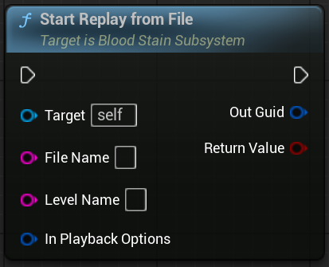

[StartRecording](#section1)

## Overview

`UBloodStainSubSystem`는 저희 플러그인의 Replay System에 파일에 대한 관리, Record와 Playback에 대한 관리를 담당하는 SubSystem입니다.

저희 플러그인의 핵심 기능을 담당하며, 대부분의 API를 제공하고 있습니다.

 

## References

| Plugin | `BloodStainSystem` |
| Module | `BloodStainSystem` |
| Header | `#include "BloodStainSubSystem.h"` |
| Source | `/Plugins/BloodStainSystem/Source/BloodStainSystem/Private/BloodStainSubSystem.cpp` |
| Super Class | `UGameInstanceSubsystem` |

 

## Properties

| Type | Name | Description |
|------------------|------------------|------------------------------|
| FileSaveOptions | FBloodStainFileOptions | File의 Save Option에 대한 프로퍼티입니다. |
| OnCompleteBuildRecordingHeader | FOnBuildRecordingHeader | File을 저장하기 직전, Broadcast를 합니다. 이를 사용해 Header Data를 수정, 대입할 수 있습니다. |

 

## Functions

### Start Recording

	

#### Description

>If the group is already recording, join the group  
Record Component is Attached to the Target Actor

#### Inputs

| Type | Name | Description |
|------|------|-------------|
| AActor* | Target Actor | The actor to record |
| FRecordOptions (Optional) | Options | Optional recording options |

#### Outputs

| Type | Name | Description |
|------|------|-------------|
| bool | Return Value | Whether the recording start is successful. If Actor is Already Recording for Target Group (Option), return false.   예상치 못한 오류 가능성 - 다른 Group에서 녹화중인 경우 이에 대해 대응에 대해 예상이 안됨. (테스트 못해봄) |

 

## Start Recording With Actors
	

#### Description

>If the group is already recording, join the group  
Record Component is Attached to the Target Actor

#### Inputs

| Type | Name | Description |
|------|------|-------------|
| TArray&lt;AActor*&gt; | Target Actors | The actors to record |
| FRecordOptions (Optional) | Options | Optional recording options |

#### Outputs

| Type | Name | Description |
|------|------|-------------|
| bool | Return Value | whether the recording start is successful |

 

## Stop Recording

#### Description

>Stop Recording Group

#### Inputs

| Type | Name | Description |
|------|------|-------------|
| FName (Optional) | Group Name | Optional group name for organizing recordings |
| bool | Save Recording Data | if false, do not save |

 

## Stop Recording RecordComponent

#### Description

>Stop recording actor. 
Group don't stop recording. if you want to stop recording group, use `UBloodStainSubsystem::StopRecord`

#### Inputs

| Type | Name | Description |
|------|------|-------------|
| URecordComponent | Record Component | Target Record Component |
| bool | Save Recording Data | if false, do not save |

 

## Start Replay From File

#### Description

> TODO

#### Inputs

| Type | Name | Description |
|------|------|-------------|
| FString | File Name | File Name |
| FString | Level Name | Level Name |
| FBloodStainPlaybackOptions (Optional) | In Playback Options | Optional playback options |

#### Outputs

| Type | Name | Description |
|------|------|-------------|
| FGuid | Out Guid | Replaying Group Key |
| bool | return value | whether the start replay is successful |

 

## Start Replay by BloodStain

#### Description

> TODO

#### Inputs

| Type | Name | Description |
|------|------|-------------|
| ABloodStainActor* | Blood Stain Actor | BloodStain Actor |

#### Outputs

| Type | Name | Description |
|------|------|-------------|
| FGuid | Out Guid | Replaying Group Key |
| bool | return value | whether the start replay is successful |

 

## Stop Replay

#### Description

> TODO

#### Inputs

| Type | Name | Description |
|------|------|-------------|
| FGuid | Playback Key | Target Playback Key |

 

## Stop Replay PlayComponent

#### Description

>This don't stop All Actors Playback. if you want to stop All of them, use `UBloodStainSubsystem::StopReplay`

#### Inputs

| Type | Name | Description |
|------|------|-------------|
| AReplayActor* | Ghost Actor | Target Playback ReplayActor |

 

## GetPlaybackGroup

#### Description

> TODO

#### Inputs

| Type | Name | Description |
|------|------|-------------|
| FGuid | In Guid | Playback Key |

#### Outputs

| Type | Name | Description |
|------|------|-------------|
| FBloodStainPlaybackGroup& | OutBloodStainPlaybackGroup | Replaying Playback Group |
| bool | return value | Whether the Playback Group is Exist |

 

## Is Playing

#### Description

> TODO

#### Inputs

| Type | Name | Description |
|------|------|-------------|
| FGuid | InPlaybackKey | Playback Key |

#### Outputs

| Type | Name | Description |
|------|------|-------------|
| bool | return value | Whether the Playback Group is Replaying |

 

## SetRecordingGroupMainActor

#### Description

> TODO

#### Inputs

| Type | Name | Description |
|------|------|-------------|
| AActor* | Target Actor | Group의 Main Actor |
| FName (Optional) | GroupName | Optional Group의 Main Actor |

 

# TODO - Function 

LoadAllHeadersInLevel
LoadAllHeadersInLevels
LoadAllHeaders

FindOrLoadRecordHeader
FindOrLoadRecordBodyData

IsFileHeaderLoaded
IsFileBodyLoaded

GetCachedHeaders
GetCachedHeadersByTags

ClearCachedData
ClearCachedBodyData

ClearAllCachedData
ClearAllCachedBodyData

DeleteFile

SetDefaultGroupName

SetReplayUserGroupData

GetFullFilePath
GetRelativeFilePath

GetSavedLevelNames
GetSavedFileNames

SetDefaultMaterial
GetDefaultMaterial

SpawnBloodStain
SpawnAllBloodStainInLevel

AddToPendingGroup
AddToPendingGroupWithActors

RemoveFromPendingGroup
RemoveFromPendingGroupWithActors

StartRecordingWithPendingGroup

SetPendingGroupMainActor

SetPendingActorUserData

<!--        

# 테스트

#### Parameters
- **Target** (`UBloodStainSubsystem*`): The subsystem that manages the recording
- **Target Actor** (`AActor*`): The actor to be recorded
- **Options** (`FRecordOptions`, *optional*): Additional record settings
- **Group Name** (`FName`, *optional*): Name of the recording group

| Name | Type | Description |
|------|------|-------------|
| Target | UBloodStainSubsystem* | The subsystem that controls recording |
| Target Actor | AActor* | The actor to record |
| Options | FRecordOptions (Optional) | Optional recording options |
| Group Name | FName (Optional) | Optional group name for organizing recordings |

#### Returns
- **Return Value** (`bool`): `true` if recording started successfully, otherwise `false`.
- **Out Guid** (`FGuid`): The key identifying the replay group that started.

### Start Recording

Starts recording a specific actor in the scene.  
If the specified group is already recording, the actor is added to that group.  
Attaches a `RecordComponent` to the target actor to begin tracking.

Use `StopRecording` to finish and optionally save the recorded data. -->