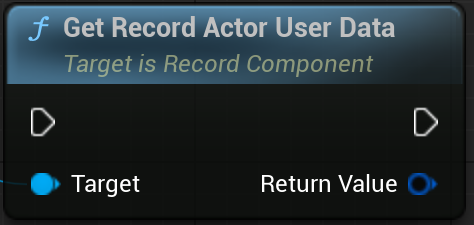
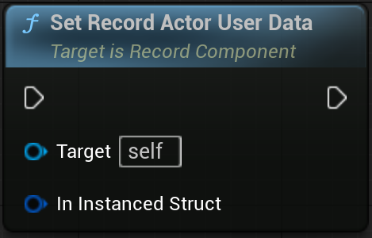
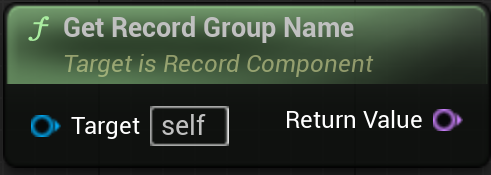

## Overview

`UPlayComponent` is create and attached by `UBloodStainSubSystem::StartReplay`.

`URecordComponent`는 플레이어의 위치 데이터 저장 및 복구 기능을 제공합니다. 예) "플레이어 위치를 자동으로 저장하고, 게임 시작 시 복원."

Unreal Engine 플러그인에서 핵심 기능을 담당하는 컴포넌트 클래스입니다. 게임 오브젝트에 추가해 XYZ 기능을 사용할 수 있습니다.

 

## References

| Plugin | `BloodStainSystem` |
| Module | `BloodStainSystem` |
| Header | `#include "RecordComponent.h"` |
| Source | `/Plugins/BloodStainSystem/Source/BloodStainSystem/Private/RecordComponent.cpp` |
| Super Class | `UActorComponent` |

 

## Properties

| Type | Name | Description |
|------------------|------------------|------------------------------|
| RecordOptions | FBloodStainRecordOptions | Record Option |

 

## Functions

### `GetRecordActorUserData()`

	

#### Description

> Returns the `FInstancedStruct` that is scheduled to be saved in the file's header data.
If it has not been set, the returned data will not be valid.

#### Inputs

| Type | Name | Description |
|------|------|-------------|
|  |  |

#### Outputs

| Type | Name | Description |
|------|------|-------------|
| FInstancedStruct | Return Value | The `FInstancedStruct` scheduled to be saved as the actor's header data. |

 

### `SetRecordActorUserData()`

	

#### Description

> Sets the actor's user data. The set data will be saved in the file's header data.

#### Inputs

| Type | Name | Description |
|------|------|-------------|
| FInstanced | InInstancedStruct | Information to be included in the file header as the actor's user data. |

#### Outputs

| Type | Name | Description |
|------|------|-------------|
|  |  |

 

### `GetRecordGroupName()`

	

#### Description

> Return Currently Recording Group Name 

#### Inputs

| Type | Name | Description |
|------|------|-------------|
| |  |

#### Outputs

| Type | Name | Description |
|------|------|-------------|
| FName | Return Value | Name of Record Group |

 

## Notes

<!-- C++의 경우 Record User Data에 관련된 template 함수를 제공합니다. -->