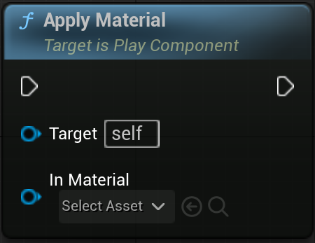

## Overview

`UPlayComponent` is a component of the ReplayActor created by `UBloodStainSubSystem::StartReplay`.
It works together with `AReplayActor` and contains logic related to replay playback.

 

## References

| Plugin | `BloodStainSystem` |
| Module | `BloodStainSystem` |
| Header | `#include "PlayComponent.h"` |
| Source | `/Plugins/BloodStainSystem/Source/BloodStainSystem/Private/PlayComponent.cpp` |
| Super Class | `UActorComponent` |

 

## Properties

| Type | Name | Description |
|------------------|------------------|------------------------------|
| RecordHeaderData | FRecordHeaderData | Header data from the replay file |
| PlaybackOptions | FBloodStainPlaybackOptions | Replay's Playback Option |
| PlaybackKey | FGuid | Currently replaying playback group key |

 

## Functions

### ApplyMaterial

	

#### Description

> Changes the Actor’s material to `InMaterial`.
If `InMaterial` is `nullptr`, it reverts to the original material.

#### Inputs

| Type | Name | Description |
|------|------|-------------|
| | |

#### Outputs

| Type | Name | Description |
|------|------|-------------|
| FInstancedStruct | Return Value | Actor's Header Data from the replay file |

 

<!-- ## Notes -->

<!-- C++의 경우 Record User Data에 관련된 template 함수를 제공합니다. -->