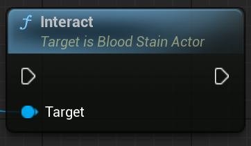

## Overview

`ABloodStainActor` is a Replay Trigger Actor generated based on the information in the header file.

Note – This actor is primarily intended for demonstration purposes. For direct management or customization, it is recommended to create your own actor or trigger using the key properties. Use `UBloodStainSubSystem::StartReplayFromFile()` instead.

 

## References

| Plugin | `BloodStainSystem` |
| Module | `BloodStainSystem` |
| Header | `#include "BloodStainActor.h"` |
| Source | `/Plugins/BloodStainSystem/Source/BloodStainSystem/Private/BloodStainActor.cpp` |
| Super Class | `ADecalActor` |

 

## Properties

| Type | Name | Description |
|------------------|------------------|------------------------------|
| ReplayFileName | FString | Replay Target File Name without Directory Path and extension |
| LevelName | FString | Replay Target Level Name |
| PlaybackOptions | FBloodStainPlaybackOptions | Replay Playback Option |
| LastPlaybackKey | FGuid | Last Played Playback Key. Use for Control Playing BloodStain |
| bAllowMultiplePlayback | uint8 : 1 | Whether to allow multiple playback. |
| InteractionWidgetClass | TSubclassOf&lt;UUserWidget&gt; | Interaction Widget Class |
| InteractionWidgetInstance | TObjectPtr&lt;UUserWidget&gt; | Current Widget Instance |
| SphereComponent | TObjectPtr&lt;USphereComponent&gt; | Interaction Overlap Shape Component |

 

## Functions

### GetHeaderData

	

#### Description

> Uses `ReplayFileName` and `LevelName` to retrieve the Header Data from the `BloodStainSubsystem`.
If the data is not already loaded, it attempts to load it.
Returns false if the loading fails.

#### Inputs

| Type | Name | Description |
|------|------|-------------|
| | |

#### Outputs

| Type | Name | Description |
|------|------|-------------|
| FRecordHeaderData | Out Record Header Data | Replay File's Header Data |
| bool | Return Value | Whether successful |

 

### Interact

	

#### Description

> Try Start Repaly

#### Inputs

| Type | Name | Description |
|------|------|-------------|
| | |

#### Outputs

| Type | Name | Description |
|------|------|-------------|
| | |

 